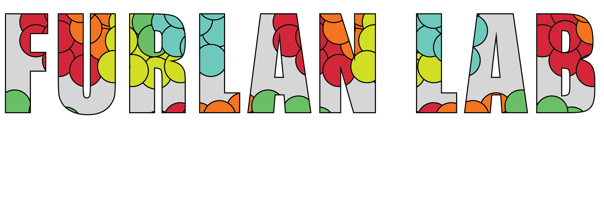

# Quantifying HLA transcripts by genotype in chimeric mixtures at single-cell resolution

**AUTHORS**

Sami B. Kanaan, Jason G. Underwood, Rula Green Gladden, Everett Fan, Shruti S. Bhise, Monica S. Thakar, Carla A. Jaeger-Ruckstuhl, Jeffrey Stevens, Ashley N. Gray, Stanley R. Riddell, Marie Bleakley, Soheil Meshinchi, Scott N. Furlan.

This repository hosts code notebooks used to generate figures from the above titled [manuscript](https://doi.org/10.1101/2025.09.12.675951).

**DATA**

Full data including all raw sequence have been deposited in NCBI's Gene Expression Omnibus and are accessible through GEO Series accession numbers [GSE305305](https://www.ncbi.nlm.nih.gov/geo/query/acc.cgi?acc=GSE305305), [GSE305306](https://www.ncbi.nlm.nih.gov/geo/query/acc.cgi?acc=GSE305306), and [GSE305307](https://www.ncbi.nlm.nih.gov/geo/query/acc.cgi?acc=GSE305307).

**SOFTWARE**

To replicate the study, the usage of [scrHLAtag](https://github.com/furlan-lab/scrHLAtag), [scrHLAmatrix](https://github.com/furlan-lab/scrHLAmatrix), and the custom made IMGT/HLA [BSgenome](https://github.com/furlan-lab/BSgenome.Hsapiens.scrHLAtyping.imgtHLA), is necessary.

</a>

